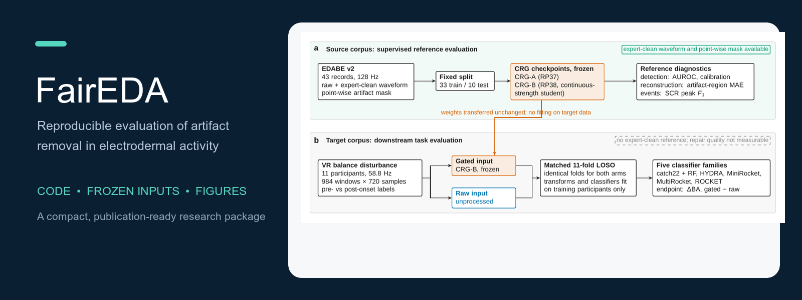

# FairEDA



**Reproducible code, frozen inputs, and publication-quality figures for artifact-removal evaluation in electrodermal activity (EDA).**

> Artifact removal improves electrodermal waveforms but not downstream classification in a virtual-reality balance task.

[](requirements.txt)
[](LICENSE)
[](https://doi.org/10.5281/zenodo.23167890)

This repository provides the analysis scripts, frozen derived inputs, vector
figures, and editable schematic sources associated with the study. The
manuscript source, compiled article, and bibliography are intentionally kept
out of this code release; the preprint will be distributed separately. No
upstream EDABE or VR raw recordings are redistributed.

**Start here:** [latest code release](https://github.com/rtb-1005/FairEDA/releases/tag/v1.0.2) · [key figures](#key-figures) · [reproduce the checks](#reproduce-the-reported-checks) · [data access](#data-access) · [citation](#citation)

## Repository layout

| Path | Contents |
| --- | --- |
| `paper/figures/` | Final vector PDFs used by the manuscript |
| `src/analysis/` | Reproducible null-evidence and participant-confound analyses |
| `figures/source/` | Frozen-input plotting and schematic builders |
| `figures/editable/` | Editable PowerPoint schematics |
| `figures/preview/` | PNG previews of selected manuscript figures |
| `data/derived/` | Derived tables and frozen window-level inputs used by the scripts |
| `data/figure_inputs/` | Frozen plotting inputs |
| `build/figures/` | Generated data-figure outputs (created by the figure command; not versioned) |
| `COMPILE_LOG.md` | Numerical checks, figure-QC, and package-scan results |

## Manuscript mapping

| Manuscript object | Reproducible source |
| --- | --- |
| Tables 1-4 and the reported null-evidence checks | `src/analysis/null_evidence_tests.py`, `data/derived/null_evidence_tests_recomputed.csv` |
| Participant-confound analysis and Figure 9 | `src/analysis/participant_confound.py`, `data/derived/participant_confound_recomputed.json`, `paper/figures/fig09_confound.pdf` |
| Figures 1-2 (schematics) | `figures/editable/fig01_design.pptx`, `figures/editable/fig02_architecture.pptx` |
| Figures 3-6 and 7-9 (manuscript figure PDFs) | `paper/figures/` |
| Rebuilt data figures and their frozen inputs | `figures/source/nature_data_figures.py`, `data/figure_inputs/`, `build/figures/` |

## Key figures

The principal figures are included as vector PDFs. The complete set is in
[`paper/figures/`](paper/figures/); the links below highlight the figures most
useful for quickly understanding the study:

| Figure | Purpose | File |
| --- | --- | --- |
| Fig. 1 | Study design and evaluation flow | [`fig01_design.pdf`](paper/figures/fig01_design.pdf) |
| Fig. 2 | Model and processing architecture | [`fig02_architecture.pdf`](paper/figures/fig02_architecture.pdf) |
| Fig. 3 | Downstream task effect | [`fig03_task_effect.pdf`](paper/figures/fig03_task_effect.pdf) |
| Fig. 4 | Waveform-level effect | [`fig04_waveforms.pdf`](paper/figures/fig04_waveforms.pdf) |
| Fig. 7 | Decision-count comparison | [`fig07_decisions.pdf`](paper/figures/fig07_decisions.pdf) |
| Fig. 9 | Participant-confound check | [`fig09_confound.pdf`](paper/figures/fig09_confound.pdf) |

The editable PowerPoint sources for the two schematics are in
[`figures/editable/`](figures/editable/). PNG previews of the key figures are
in [`figures/preview/`](figures/preview/) for quick browsing on GitHub.

## Requirements

Python 3.12 or newer and a LaTeX installation with `pdflatex` and `bibtex` are recommended. Install the Python dependencies with:

```sh
python -m pip install -r requirements.txt
```

## Reproduce the reported checks

From the repository root:

```sh
python src/analysis/null_evidence_tests.py
python src/analysis/participant_confound.py
```

The scripts write their recomputed summaries under `data/derived/`. They operate on frozen derived inputs and do not train models or redistribute upstream recordings.

## Rebuild data figures

```sh
python figures/source/nature_data_figures.py --output build/figures
```

The generated PDFs are deterministic displays of the frozen inputs. The two schematics are native editable PowerPoint files in `figures/editable/`; their builder requires the bundled presentation runtime or a compatible Node.js installation.

## Data access

The upstream datasets must be obtained from their original repositories under their stated licences:

- EDABE v2, Mendeley Data: https://doi.org/10.17632/w8fxrg4pv5.2
- VR balance-disturbance corpus, Zenodo: https://doi.org/10.5281/zenodo.14013468

No original dataset files are included here. The included files are derived or frozen analysis inputs prepared for the manuscript figures and checks.

## Reproducibility boundary

**Directly reproducible:** frozen-input figures, null-evidence checks, and participant-confound check.

**Requires upstream data and the training environment:** training or refitting the residual gate and regenerating upstream predictions.

**Not included:** trained model weights, full upstream recordings, and per-window prediction arrays that are not needed by the included frozen-input checks.

## Citation

Please cite the associated manuscript once the preprint is released, and cite
this repository using the Zenodo concept DOI [10.5281/zenodo.23167890](https://doi.org/10.5281/zenodo.23167890).
